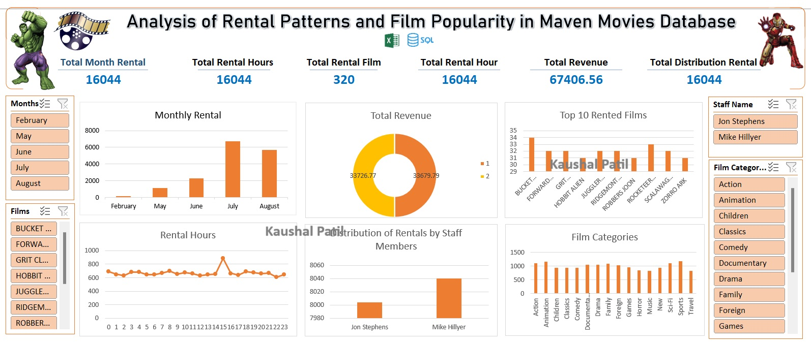

# Analyzing Rental Patterns and Film Popularity in the Maven Movies Database Project 

## Maven Analytics Assignment Case Study Competition:
🧩 Situation: Maven Movies is a DVD Rental Business

🧩 In the operations role, I have to learn everything about the business like:

## Product Inventory

Staff

## Customer Purchase Behaviour, etc.

## 🧩 Provided with Maven Movies SQL database has to:

Access & Explore the same

Develop a firm grasp of 16 tables

How they relate to each other

Analyse all aspects of the company's database

